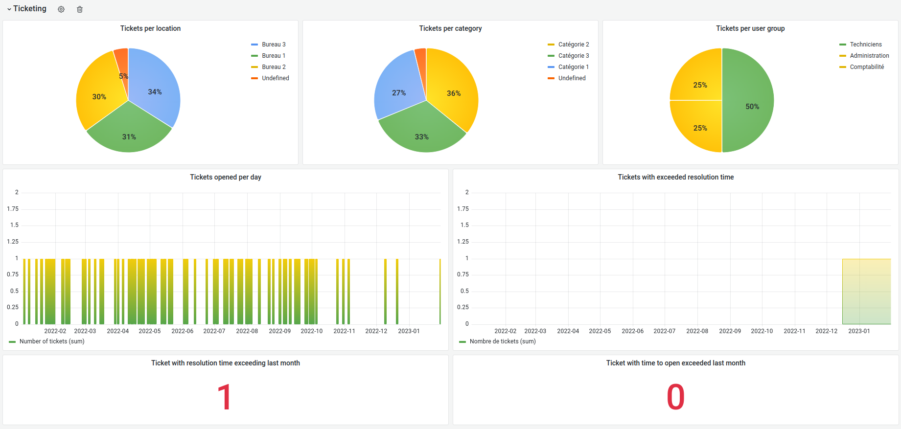
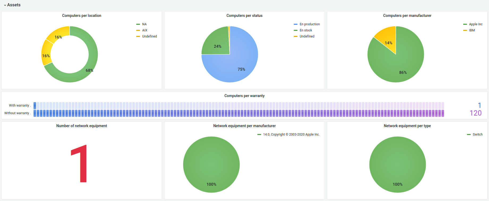
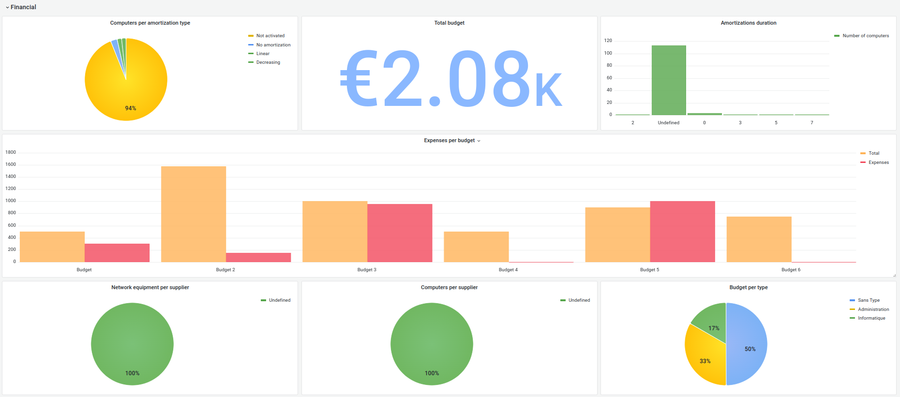

ITSM-NG is a GLPI fork with the objective of offering a strong community component and relevant technological choices.

# Some Links

  - [Website](https://www.itsm-ng.com)
  - [Github](https://github.com/itsmng)
  - [Wiki](https://wiki.itsm-ng.org)

# Introduction

Grafana is the open source analytics & monitoring solution that allow you to manage dashboard and unify multiple data sources. We provide a default template which can be used in order to provide reporting.

# Setup Grafana dashboard

To install and configure ITSM-NG Grafana dashboard, please refer to our documentation : [Grafana dashboard](https://wiki.itsm-ng.org/third-party/grafana/).

# Report list 

The default provided dashboard contains three different type of reporting : 

* Ticketing
	* Tickets opened per day
	* Tickets per location / category / user group
	* Tickets with exceeded resolution time
	* Tickets with exceeded resolution time last month
	* Tickets with time to open exceeded last month

* Assets
	* Computers per location / status / warranty / manufacturer
	* Network equipment per type / manufacturer
	* Number of network equipment

* Financial
	* Total budget
	* Budget per type
	* Expenses per budget
	* Amortizations duration
	* Computers per supplier / amortization type
	* Network equipment per supplier

